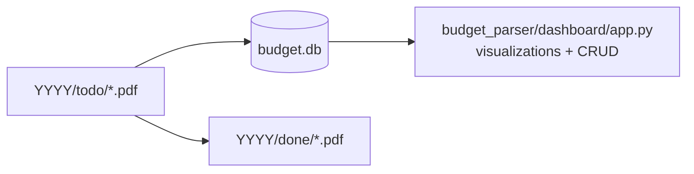

# Personal Budget Tool - Technical Flow Diagram

This document captures the end-to-end runtime flow for statement ingestion, categorization, and dashboard visualization.

## End-to-End System Flow

```mermaid
flowchart TD
    U[User] --> C1[Run extraction CLI\npython -m budget_parser extract --year YYYY]
    U --> C2[Run categorization CLI\npython -m budget_parser categorize --year YYYY]
    U --> C3[Run dashboard\npython -m budget_parser serve]

    subgraph S1[Stage 1: Extraction Pipeline]
        C1 --> M1[budget_parser/cli/extract.py\nparse args + load settings]
        M1 --> P1[Pipeline.run]
        P1 --> FM1[FileManager.ensure_folders_exist]
        FM1 --> FM2[FileManager.get_pending_pdfs\nfrom YYYY/todo/*.pdf]
        FM2 --> L0{Any PDFs?}
        L0 -- No --> X0[Exit with warning]
        L0 -- Yes --> LP[Loop each PDF]

        LP --> PE1[PDFExtractor.extract_full_text]
        LP --> PE2[PDFExtractor.extract_text_chunks]
        PE2 --> LC[Loop each chunk]

        LC --> LE[LLMExtractor.extract\nOllama chat format=json]
        LE --> TV[TransactionValidator.validate\nanti-hallucination checks]
        TV --> RF{Validated count == 0\nand regex fallback enabled?}
        RF -- Yes --> RE[RegexExtractor.extract]
        RE --> TV2[TransactionValidator.validate]
        RF -- No --> ACC[Accumulate validated transactions]
        TV2 --> ACC

        ACC --> FLT[KeywordFilter chain\nRewards -> Payment -> Aggregate]
        FLT --> DB1[upsert_transactions\ninto budget.db\n(infer_years MM/DD -> YYYY-MM-DD)]
        DB1 --> MV{move_to_done enabled?}
        MV -- Yes --> FM3[FileManager.move_to_done\nYYYY/todo -> YYYY/done]
        MV -- No --> NX[Next PDF]
        FM3 --> NX
    end

    subgraph S2[Stage 2: Categorization]
        C2 --> K1[budget_parser/cli/categorize.py\nload settings + init logger]
        K1 --> DBI[init_db budget.db]
        DBI --> PND[get_uncategorized_transactions\nfrom budget.db]
        PND --> Q1{Any uncategorized rows?}
        Q1 -- No --> DONE1[Exit]
        Q1 -- Yes --> RC[RegexCategorizer pre-pass\nfirst-match rule wins]
        RC --> AGT[CategorizationAgent\nOllama batch categorization]
        AGT --> BUP[bulk_update_transaction_categories]
    end

    subgraph S3[Dashboard + Operations]
        C3 --> YR[get_available_years from budget.db]
        YR --> LD[get_transactions for selected year]
        LD --> CH[Streamlit + Plotly charts\nMonthly overview + MoM]
        LD --> TX[Transactions tab\nmanual edit/add/delete]
        LD --> CAT[Categories tab CRUD\nrename cascades to transactions]
        LD --> RUL[Regex Rules tab CRUD]

        TX --> DBW1[(budget.db)]
        CAT --> DBW1
        RUL --> DBW1
        DBW1 --> LD
    end

    BUP --> DBW1
```

## Runtime Data Artifacts



## Notes

- The app is effectively a two-stage processing pipeline plus a DB-backed dashboard.
- `budget.db` is the primary (and only) store for transactions, categories, and regex rules.
- Dashboard edits (transactions/categories/regex rules) update `budget.db` directly and are reflected on reload.
